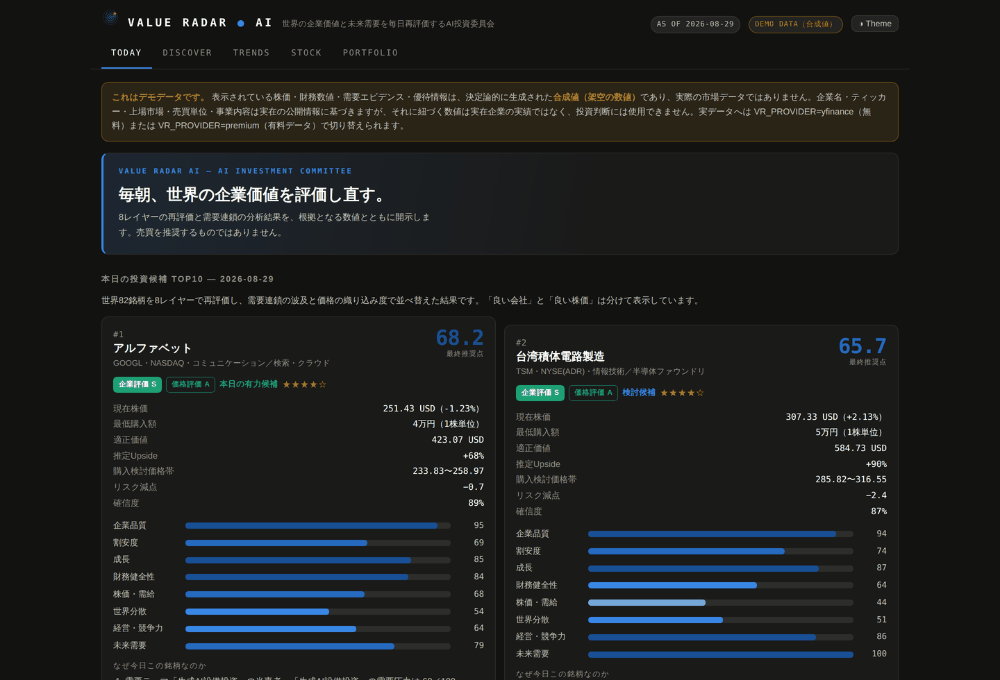
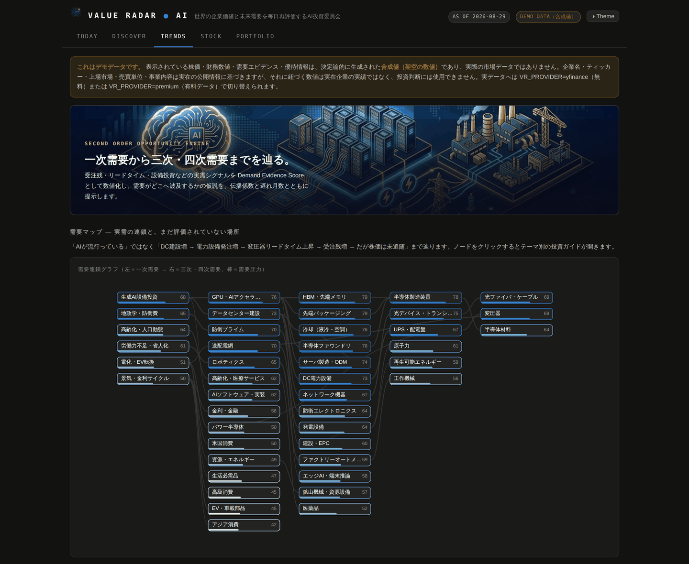
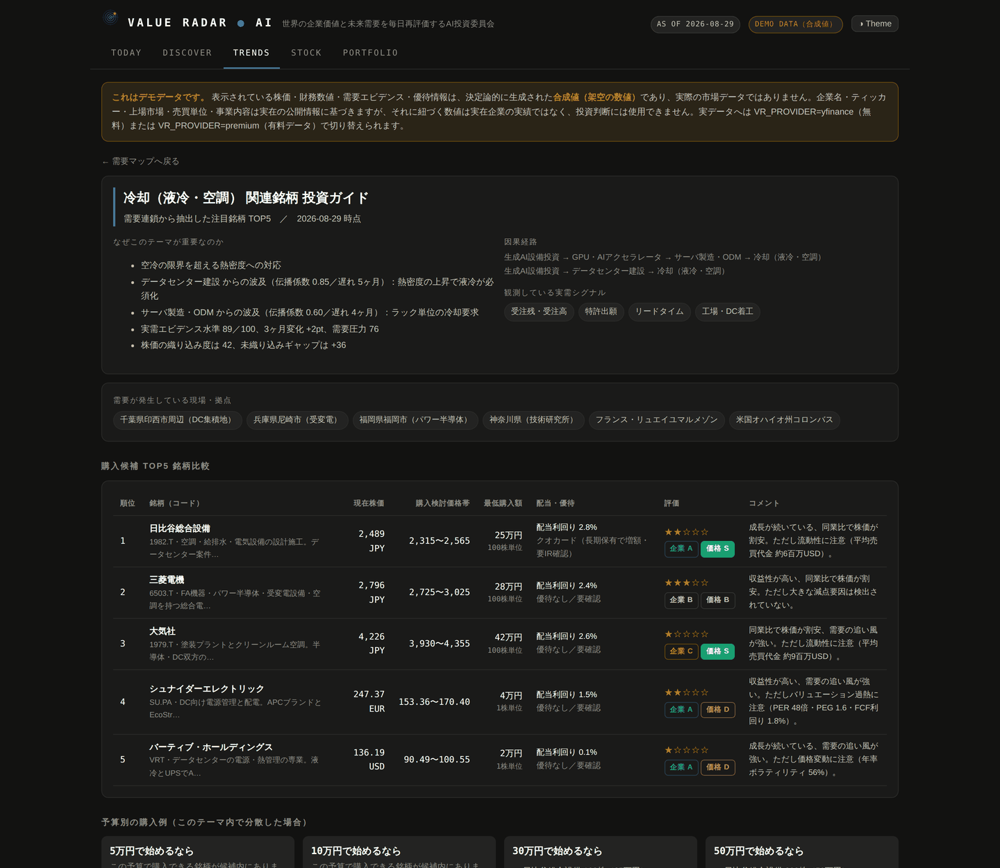
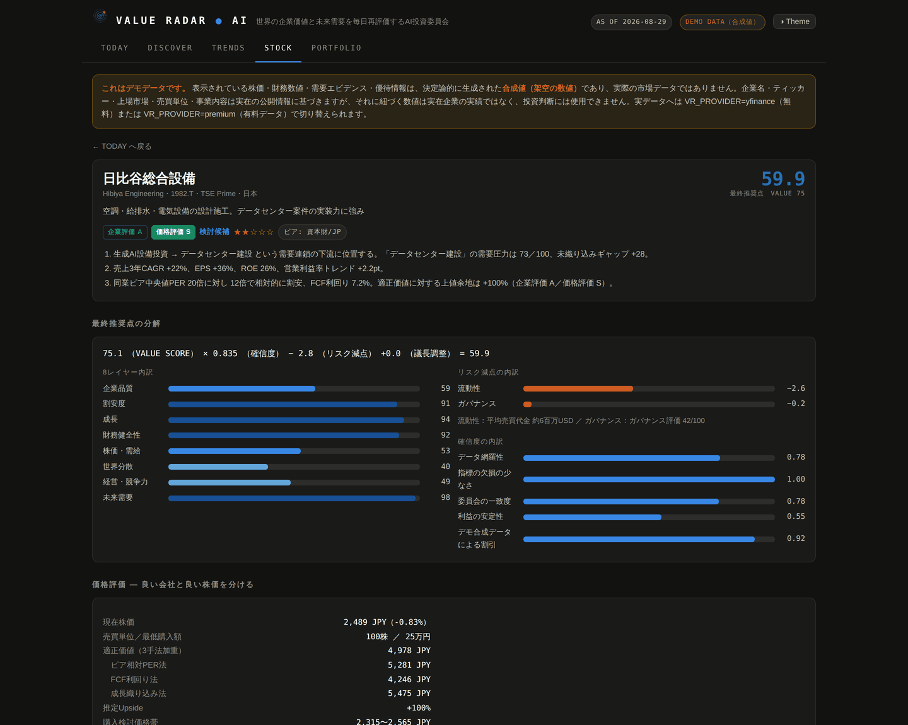
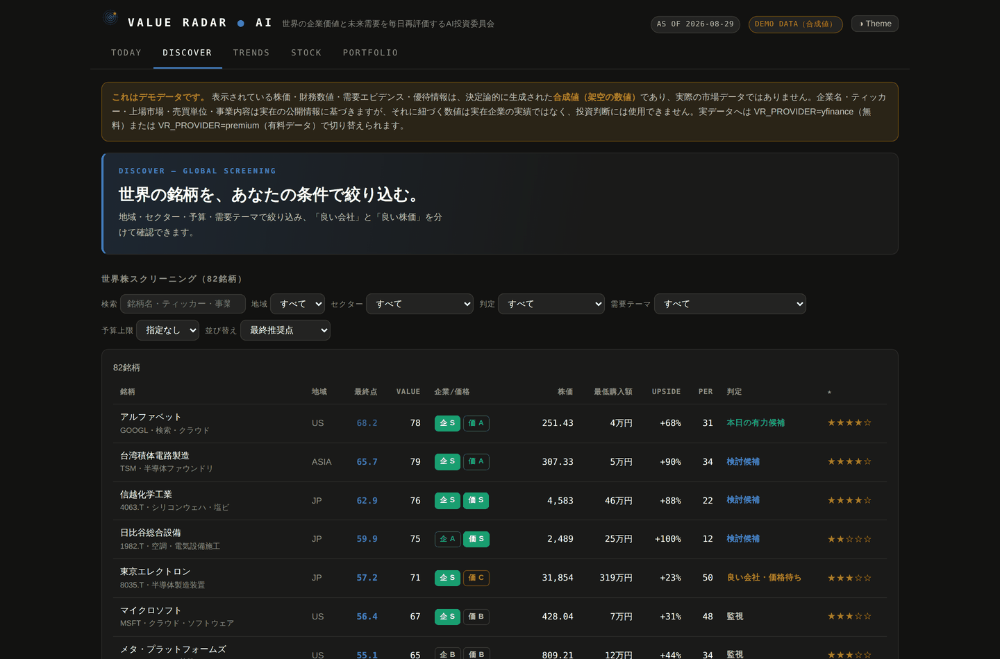
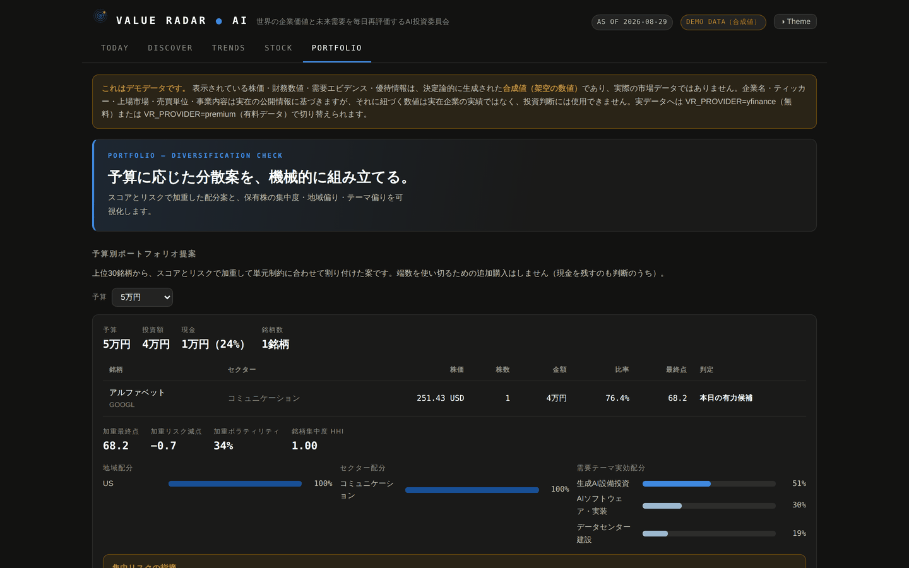

# VALUE RADAR AI

**「今日上がりそうな株」を当てるアプリではありません。**
企業価値に対して現在価格が魅力的で、かつ**構造的な需要の追い風**がある企業を、
毎日 世界ユニバースから抽出する意思決定支援アプリです。

> 位置づけ：**AI株価予想アプリ**ではなく、
> **世界の企業価値と未来需要を毎日再評価するAI投資委員会**。



> **注意：** 既定のデータは実在企業名に紐づけて生成された**合成値（架空の数値）**です。
> 実際の株価・財務ではありません。詳細は [DISCLAIMER.md](DISCLAIMER.md) を参照してください。

---

## 0. 30秒で動かす

```bash
git clone <this-repo> && cd value-radar-ai
python3 -m engine.pipeline        # 依存パッケージ不要（標準ライブラリのみ）
python3 -m http.server 8000       # → http://localhost:8000/
```

`./scripts/serve.sh` でも同じことができます。**ビルド工程はありません。**
Python 3.10+ があれば動きます。

---

## 1. このアプリの中心思想

### 1-1. 単純平均を使わない

PER と ROE のように単位も分布も違う指標をそのまま平均するのは危険です。
本エンジンは各指標を **業種 × 地域のピアグループ内で標準化（z値）** し、
外れ値を ±2.5σ で winsorize したうえで 0–100 に写します。
欠損は平均値で埋めず、レイヤー内の重みを再配分し、**確信度を下げる形で罰します**。

### 1-2. VALUE SCORE（100点満点）

| 評価レイヤー | 配点 | 主な指標 |
|---|---:|---|
| 企業品質 Quality | 20 | ROE, ROIC, 営業利益率, FCFマージン, 利益安定性 |
| 割安度 Value | 20 | PER, 予想PER, PBR, EV/EBITDA, FCF利回り, PEG |
| 成長 Growth | 15 | 売上/EPS/FCF の3年CAGR, 利益率トレンド, 予想改定率 |
| 財務健全性 Health | 10 | D/E, ネット負債/EBITDA, 流動比率, 利払カバレッジ |
| 株価・需給 Momentum | 10 | 1/3/6/12ヶ月モメンタム, 出来高, 52週高値距離 |
| 世界分散適合度 | 5 | 地域・通貨・業種・時価総額の希少性 |
| 経営・競争力 Governance | 10 | 経済的な堀, ガバナンス, 資本配分, 企業文化, IR対話 |
| 未来需要 Trend | 10 | 需要連鎖グラフからの波及圧力と未織り込み度 |

```
最終推奨点 = VALUE SCORE × 確信度 − Risk Penalty ＋ 議長調整
```

- **確信度（0.55–1.00）** … データ網羅性・指標欠損・委員会の一致度・利益安定性から算出。掛け算にしているのは「データが薄い」「意見が割れている」銘柄の高得点を素直に信じないため。
- **Risk Penalty（0–25点）** … 価格変動／最大下落／財務レバレッジ／**バリュエーション過熱**／流動性／ガバナンス／テーマ集中／群集。**内訳を必ず表示**します（説明できない減点はしません）。

コモンズ投信が重視する「見える財務価値だけでなく、競争力・経営力・対話力・企業文化を評価する」という思想は、
Governance レイヤー（moat / governance / capital allocation / culture / IR dialogue）として組み込んでいます。

### 1-3. 「良い会社 ≠ 良い株価」を構造的に分ける

企業評価グレードと価格評価グレードを**別々に**出します。

```
企業評価  = 0.32×Quality + 0.20×Growth + 0.26×Governance + 0.22×Trend
価格評価  = Value レイヤー ＋ 割高キャップ
```

割高キャップ（絶対条件）に触れた銘柄は、企業評価がどれだけ高くても価格評価に上限がかかります。

| 条件 | 価格評価の上限 |
|---|---|
| PER > 80倍 | D |
| PER > 55倍 | C |
| PEG > 3.5 | C |
| FCF利回り < 1.0% | C |
| EV/EBITDA > 40倍 | C |

結果として、`企業評価 S ／ 価格評価 C` は **「良い会社・価格待ち」** に分類され、
購入プランには載りません。逆に `企業評価 A ／ 価格評価 S` は「本日の有力候補」へ昇格します。

---

## 2. 最大の差別化 — 需要連鎖AI（Second Order Opportunity Engine）

普通の株式スクリーナーとの決定的な違いはここです。

```
生成AI設備投資
  → GPU・AIアクセラレータ
      → HBM・先端メモリ / 先端パッケージング / 半導体ファウンドリ
          → 半導体製造装置 → 半導体材料
  → データセンター建設
      → DC電力設備 → UPS・配電盤 → 変圧器 → 送配電網 → 発電設備 → 原子力
      → 冷却（液冷・空調）
      → ネットワーク機器 → 光デバイス → 光ファイバ
      → 建設・EPC
```

45ノード・44エッジの有向非巡回グラフとして定義され、
各エッジは **lag_months（需要が届くまでの月数）** と **elasticity（伝播係数）** を持ちます
（`engine/demand/graph.py`）。

### 2-1. 実需で判定する — Demand Evidence Score

「AIが流行している」ではなく、次の観測項目を重み付けして数値化します。

| シグナル | 重み | | シグナル | 重み |
|---|---:|---|---|---:|
| 受注残・受注高 | 1.30 | | 稼働率 | 1.00 |
| リードタイム | 1.20 | | 政府予算・補助金 | 0.95 |
| 設備投資計画 | 1.15 | | 価格・スポット指標 | 0.85 |
| 工場・DC着工 | 1.10 | | 求人数 | 0.80 |
| 電力需要・系統接続申請 | 1.10 | | 特許出願 | 0.60 |
| 出荷統計 | 1.05 | | 経営者発言 | 0.55 |

受注残とリードタイムを最重視しているのは、**人気ではなく実需**に最も近いからです。

### 2-2. 未織り込みギャップ（Unpriced Gap）

```
需要圧力   = 自ノードの実需水準・変化 ＋ 上流からの流入（lag と elasticity で減衰）
織り込み度 = そのノードに属する企業群の 割高パーセンタイル×0.6 ＋ モメンタム×0.4
未織り込みギャップ = 需要圧力 − 織り込み度   （深いノードほど発見価値ボーナス）
```

これが「**NVIDIA が上がりきった後、次に利益が流れ込むのに、まだ十分評価されていない場所**」を指します。
需要圧力が 55 未満のノードは対象外です（「安いだけ」は機会ではありません）。

---

## 3. AI投資委員会（6エージェント）

単一のモデルに「買いか売りか」を答えさせません。

| エージェント | 目的関数 |
|---|---|
| Value Analyst | 割安度・適正価値からの上値余地 |
| Growth Analyst | 成長の量と質（利益率トレンドを含む） |
| Macro Analyst | 地域・通貨・金利感応度・分散適合 |
| Technology Analyst | 需要連鎖上の位置と未織り込み度 |
| Risk Analyst | リスク減点の構造 |
| **Contrarian Analyst** | **反対仮説（他5名の賛成が強いほど厳しく反論する）** |

Contrarian は「現在のPERが EPS成長率で何年先の利益まで織り込んでいるか」を計算し、
5年を超える先取りがあれば減点します。
議長役は反対意見を読んだうえで最終点を調整し、その理由を `dissent` として明示します。

> 例：*「5名が前向きな一方、Contrarian Analyst が確信度78%で反論。現在のPER 62倍は、EPS成長率28%が続く前提で約8年先の利益まで既に織り込んでいる。議長はこの反論を採用し、最終点を −4.7点 調整した。」*

各エージェントは **(スタンス, 確信度, 根拠テキスト, 参照した数値)** を必ず返します。
根拠のない結論を出力できない構造です。

---

## 4. 画面構成（5画面）

| 画面 | 内容 |
|---|---|
| **TODAY** | 本日の投資候補 TOP10。3行の理由、最低購入額、適正価値、購入検討価格帯、前日差分アラート、未織り込みギャップ上位 |
| **DISCOVER** | 世界株スクリーニング。地域・セクター・判定・需要テーマ・**予算上限**で絞り込み |
| **TRENDS** | 需要マップ（連鎖グラフ）。ノードをクリックすると**テーマ別 投資ガイド**が開く |
| **STOCK** | 1社の詳細。スコアの分解、価格評価の上限理由、AI投資委員会6名の意見、需要連鎖上の位置、推移 |
| **PORTFOLIO** | 予算別の購入プランと、保有株の集中度・リスク分析 |

### 4-1. テーマ別 投資ガイド

需要ノード1つを「テーマ」とみなし、配布資料の粒度まで自動生成します。

- なぜこのテーマが重要なのか（因果と実需エビデンス）
- 因果経路と観測シグナル
- **需要が発生している現場・拠点**
- **購入候補 TOP5 比較表**（現在株価／購入検討価格帯／最低購入額／配当・優待／★評価／コメント）
- **予算別の購入例**（5万・10万・30万・50万円）
- 初心者が押さえる3点と注意点

### 4-2. 投資金額を必ず円で出す

- 日本株：`現在株価 × 売買単位（多くは100株）` で最低投資額を算出
- 米欧株：1株単位、韓国・台湾は銘柄ごとの単位
- すべて円換算（`engine/output/fx.py`。実運用では為替APIに差し替え）
- 予算プリセット **5万 / 10万 / 30万 / 50万 / 100万 / 300万 / 1,000万円**
- 割り付けは「スコア加重 × リスク逆数」→ 単元制約に合わせて整数へ丸め
- **端数を使い切るための追加購入はしません**（現金を残すのも判断のうち）
- **「良い会社・価格待ち」「見送り」の銘柄は購入プランに載せません**（アプリ自身が待てと言っているものを買わせない）

---

## 5. 世界分散（オルカン思想の使い方）

eMAXIS Slim 全世界株式（オール・カントリー）は MSCI ACWI への連動を目指すインデックスファンドであり、
**アクティブな銘柄選択モデルではありません**。MSCI ACWI は先進国・新興国の大型・中型株で
投資可能株式市場の約85%をカバーします。

本アプリはこの考え方を **「母集団の設計思想」** として使います。

```
世界分散（母集団の設計）
   ↓
財務スクリーニング
   ↓
コモンズ型 Quality 分析（競争力・経営力・対話力・企業文化）
   ↓
割安分析（良い会社と良い株価を分ける）
   ↓
需要連鎖分析（二次・三次波及の発見）
   ↓
リスク分析
   ↓
TOP100 → TOP30 → TOP10
```

デモユニバースは日米欧アジアの **82銘柄**（日本32・米国34・欧州10・アジア6）です。
AI→電力の需要連鎖の川上から川下までを意図的に含めてあります。

---

## 6. アーキテクチャ

```
世界の公開データ
      ↓
  DATA INGESTION        providers/  ← ここだけを差し替える
      ↓
  DATA NORMALIZATION    scoring/normalize.py（業種×地域のz標準化）
      ↓
  企業マスター           universe.py
      ↓
  VALUE / QUALITY / GROWTH / TREND / RISK ENGINE   scoring/
      ↓
  Demand Graph AI       demand/（一次 → 二次 → 三次需要）
      ↓
  総合 VALUE SCORE      scoring/aggregate.py
      ↓
  AI Investment Committee   committee/
      ↓
  TOP100 / TOP30 / TOP10
      ↓
  理由生成AI            committee/narrator.py（既定テンプレート／LLM差し替え可）
      ↓
  ユーザーアプリ         index.html + web/（ビルド不要のvanilla ESM）
```

```
value-radar-ai/
├── index.html                 # SPA本体（GitHub Pages のルート）
├── web/style.css, web/js/     # ビルド不要のESM（util / charts / views / app）
├── engine/
│   ├── universe.py            # 企業マスター（82銘柄）
│   ├── pipeline.py            # 日次パイプライン
│   ├── providers/             # ★ データ層（差し替え点）
│   │   ├── base.py            #   Fundamentals / EvidenceItem のデータ契約
│   │   ├── demo_provider.py   #   標準ライブラリのみ・決定論的な合成データ
│   │   ├── yfinance_provider.py
│   │   ├── premium_provider.py#   Bloomberg / LSEG / FactSet / CapIQ のスタブ
│   │   └── registry.py
│   ├── scoring/               # normalize / layers / risk / valuation / aggregate
│   ├── demand/                # graph（45ノード） / propagation
│   ├── committee/             # agents（6名） / narrator
│   └── output/                # budget / theme_guide / alerts / fx
├── data/                      # latest.json, series.json, alerts.json, history/
├── tests/                     # 60テスト（標準ライブラリのみ）
├── .github/workflows/         # daily.yml（毎日の定期監視） / ci.yml
└── scripts/                   # run_daily.sh / install_cron.sh / serve.sh
```

---

## 7. データ層の差し替え（有料APIへの移行）

**評価エンジンとデータAPIは完全に分離**されています。
エンジンが知っているのは `Fundamentals` / `EvidenceItem` という2つのデータ契約だけです。

```bash
python3 -m engine.pipeline                      # デモ（既定・オフライン）
VR_PROVIDER=yfinance python3 -m engine.pipeline # 無料の実データ
VR_PROVIDER=premium VR_PREMIUM_VENDOR=lseg \
  VR_PREMIUM_KEY=xxx python3 -m engine.pipeline # 有料データ
```

有料層は `engine/providers/premium_provider.py` の `_fetch()` を実装するだけです。
Bloomberg / LSEG / FactSet / S&P Capital IQ のフィールド対応表は同ファイルに用意済みです。
詳細は [docs/DATA_PROVIDERS.md](docs/DATA_PROVIDERS.md)。

| 環境変数 | 用途 | 既定 |
|---|---|---|
| `VR_PROVIDER` | 株価・財務のプロバイダ | `demo` |
| `VR_EVIDENCE_PROVIDER` | 需要エビデンスのプロバイダ | `demo` |
| `VR_PREMIUM_VENDOR` | `bloomberg` / `lseg` / `factset` / `capiq` | `lseg` |
| `VR_PREMIUM_KEY`, `VR_PREMIUM_ENDPOINT` | 有料APIの認証 | — |
| `VR_FX_PROVIDER` | 為替レート | `demo` |
| `VR_LLM` | 理由生成に `anthropic` / `openai` を使う | 未設定（テンプレート） |

---

## 8. 毎日の定期監視

### GitHub Actions（推奨）

`.github/workflows/daily.yml` が **毎朝 06:30 JST** に実行され、

1. 日次パイプラインを実行
2. `data/history/` / `data/series.json` / `data/alerts.json` を更新してコミット
3. **高重要度アラートがあれば Issue を自動作成**
4. 当日の `data/latest.json` を成果物として受け渡し、GitHub Pages へ配信

`latest.json`（約900KB）は毎日コミットするとリポジトリが年300MB超で膨らむため、
コミットせず配信物にだけ含めています（詳細は [docs/OPERATIONS.md](docs/OPERATIONS.md)）。
リポジトリ同梱の `latest.json` は clone 直後に動かすためのシードです。

リポジトリ Settings → Pages を **GitHub Actions** に設定してください。
プロバイダを切り替える場合は、リポジトリ変数 `VR_PROVIDER` とシークレット `VR_PREMIUM_KEY` を設定します。

### ローカル cron

```bash
./scripts/install_cron.sh        # 毎朝6時30分に登録
./scripts/run_daily.sh           # 手動実行
```

### 検知するアラート

| 種別 | 条件 |
|---|---|
| TOP10 新規参入 / 脱落 | 順位の入れ替わり |
| スコア急変 | 最終推奨点が ±6点以上 |
| 投資判断の変化 | verdict の遷移 |
| **価格評価の改善** | 企業評価 S/A の銘柄の価格評価が上昇（＝良い会社がついに買える価格に近づいた） |
| **購入検討価格帯への突入** | 株価が検討帯に入った |
| 需要テーマの変化 | ノード需要圧力が ±8pt以上 |

---

## 9. テスト

```bash
python3 -m unittest discover -s tests -v     # 60テスト・依存なし
```

主要な不変条件を検証しています。

- 需要グラフが非巡回で、ユニバースの露出キーが全てグラフに存在する
- レイヤー配点の合計が 100
- 欠損があってもスコアは下がらない（下がるのは確信度）
- **PER 80倍・FCF利回り1%の高品質株は必ず価格評価 D になる**
- 予算プランが予算を超えない／単元の整数倍である／「価格待ち」銘柄を含まない
- `最終推奨点 = VALUE × 確信度 − リスク ＋ 議長調整` が実際に成立している
- 同じ日付なら何度実行しても同じ結果（再現性）

---

## 10. 正直な注意書き

- **既定のデータは合成値です。** 実在企業の名称・ティッカー・売買単位・事業内容は公開情報に基づきますが、株価・財務数値・需要エビデンス・優待情報はデモ用に生成された値であり、実在企業の評価には使えません。UI とJSON には常に `DEMO DATA` バッジ／`is_demo_data: true` が付きます。
- **バックテストは含まれていません。** このスコアリングが超過リターンを生むかは未検証です。
- 需要連鎖の伝播係数と遅れ月数は**設計者の仮説**であり、実測された弾性値ではありません。
- 本ソフトウェアは投資助言ではありません。→ [DISCLAIMER.md](DISCLAIMER.md)

---

## ドキュメント

- [docs/SCORING.md](docs/SCORING.md) — スコアリングの完全な計算式
- [docs/DEMAND_GRAPH.md](docs/DEMAND_GRAPH.md) — 需要連鎖グラフの定義と拡張方法
- [docs/DATA_PROVIDERS.md](docs/DATA_PROVIDERS.md) — 有料データ層への移行手順
- [docs/OPERATIONS.md](docs/OPERATIONS.md) — 運用・監視・拡張
- [DISCLAIMER.md](DISCLAIMER.md) — 免責事項

## ライセンス

MIT

---

## 画面

すべて実際の画面のスクリーンショットです（デモデータでの表示）。

### TODAY — 本日の投資候補 TOP10


### TRENDS — 需要マップ（一次 → 三次・四次需要）


### テーマ別 投資ガイド
需要ノードをクリックすると、そのテーマの比較表・購入検討価格帯・予算別購入例まで自動生成されます。



### STOCK — スコアの分解とAI投資委員会


### DISCOVER — 世界株スクリーニング


### PORTFOLIO — 予算別プランと集中度分析


### 画像アセットについて

| ファイル | 内容 |
|---|---|
| `web/assets/logo.svg` / `logo.png` / `logo-128.png` | ロゴ・favicon（同心円のレーダーと、検知した1銘柄を表す金のブリップ） |
| `web/assets/demand-chain.jpg` | TRENDS 見出しの概念図。生成AI → GPU → データセンター → 送配電 → 発電 → 建設への波及を図解したイメージ画像 |
| `docs/screenshots/*.png` | 実画面のスクリーンショット |

TODAY / DISCOVER / STOCK / PORTFOLIO の見出しは、画像ではなくテーマトークンで組んだ文字帯です。
自分の画面のスクリーンショットを自分の画面の上に重ねても情報が増えないため、意図的に画像を置いていません。

---

## 付録：単一HTMLファイル版

サーバも依存も不要な1枚のHTMLを生成できます（配布・オフライン閲覧用）。

```bash
python3 scripts/build_single_file.py      # → dist/value-radar-ai.html
```

CSS・JS・画像・その日のデータをすべて埋め込むため約1.3MBになります。
`data/latest.json` を更新したら作り直してください。
